# Problem Set 1

## Getting Started

**Using Python 3.9 or newer,** create a virtual environment as follows:

```
python3 -m venv venv
source venv/bin/activate
```

Next, install PyTorch using the instructions [here](https://pytorch.org/get-started/locally/). Select pip as the installation method. **If you're on Linux and have a CUDA-capable GPU, select the latest CUDA version.** This will give you a command like this:

```
pip3 install torch torchvision torchaudio --index-url https://download.pytorch.org/whl/cu118
```

Finally, install this homework's other dependencies:

```
pip install -r requirements.txt
```

You can now open the project directory in VS Code. Within VS Code, open the command palette (<key>⌘ command</key> <key>⇧ shift</key> <key>P</key>), run `Python: Select Interpreter`, and choose the virtual environment you created in the previous steps.

For the best editing experience, install the following VS Code extensions:

* Python (`ms-python.python`)
* Pylance (`ms-python.vscode-pylance`)
* Black Formatter (`ms-python.black-formatter`)
* Ruff (`charliermarsh.ruff`)

## Part 0: Introduction

This part doesn't involve programming. Just run the script using the provided VS Code launch configuration:

- Navigate to the debugger (<key>⌘ command</key> <key>⇧ shift</key> <key>D</key>).
- Select `Part 0: Introduction` from the drop-down menu.
- Click the green run button.

<!-- <details>
<summary>Running code directly from a command line (not recommended)</summary>
<br> -->

Remember to activate your virtual environment using `source venv/bin/activate` first. Then, run the following command:

```
python3 -m scripts.0_introduction
```

</details>

## Part 1: Point Cloud Projection (15 pts)

In this part, you'll have to fill out the following files:

- `src/geometry.py`
- `src/rendering.py`

Check your work by running:
```
python3 -m scripts.1_projection
```
This will write the rendered images to the directory `outputs/1_projection`.

#### Notes on Camera Formats

##### Extrinsics

In this class, camera extrinsics are represented as 4x4 matrices in OpenCV-style camera-to-world format. This means that matrix-vector multiplication between an extrinsics matrix and a point in camera space yields a point in world space.

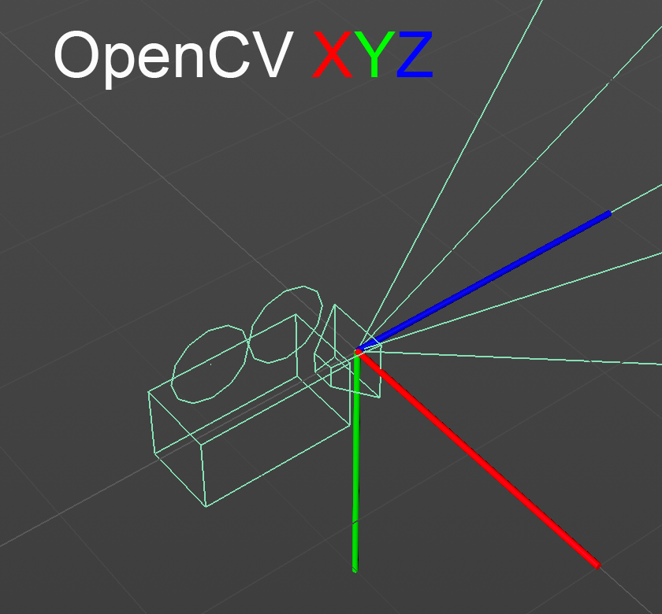

##### Intrinsics

In this class, camera intrinsics are represented as 3x3 matrices that have been normalized via division by the image height $h$ and image width $w$.

$$
K = \begin{bmatrix}
    \frac{f_x}{w} & 0 & \frac{c_x}{w} \\
    0 & \frac{f_y}{h} & \frac{c_y}{h} \\
    0 & 0 & 1
\end{bmatrix}
$$

#### Notes on Type Checking

All of the functions in this homework are annotated with types. These are enforced at runtime using [jaxtyping](https://github.com/google/jaxtyping) and [beartype](https://github.com/beartype/beartype). If you're not familiar with `jaxtyping`, you should read the (short) [jaxtyping documentation](https://docs.kidger.site/jaxtyping/api/array/) to learn the tensor annotation format.

**Hint:** These annotations have important implications for broadcasting. If your code does not support the broadcasting implied by the annotations, you will not get full credit. See the note below for more details.

<details>
<summary>A note on the batch dimension annotations used in the homework.</summary>
<br>

The annotations `*batch` and `*#batch` are used for functions that can handle inputs with arbitrary batch dimensions. They differ in that `*#batch` states that batch dimensions can be broadcasted. For example:

```python
def broadcastable(a: Float[Tensor, "*#batch 4 4"], b: Float[Tensor, "*#batch 4"]) -> Float[Tensor, "*batch"]:
    ...

# This works, because the shapes (1, 2, 3, 1) and (2, 3, 5) can be broadcasted.
broadcastable(
    torch.randn((1, 2, 3, 1, 4, 4)),  # a
    torch.randn((2, 3, 5, 4)), # b
)

def not_broadcastable(a: Float[Tensor, "*batch 4 4"], b: Float[Tensor, "*batch 4"]):
    pass

# This doesn't work, since the shapes (1, 2, 3, 1) and (2, 3, 5) are not exactly the same.
not_broadcastable(
    torch.randn((1, 2, 3, 1, 4, 4)),  # a
    torch.randn((2, 3, 5, 4)), # b
)
```

All functions in `geometry.py` that have multiple parameters use `*#batch`, meaning that you must fill them out to handle broadcasting correctly. The functions `homogenize_points` and `homogenize_vectors` instead use `*batch`, since broadcasting doesn't apply when there's only one parameter. All functions return `*batch`, which means that outputs should have a fully broadcasted shape. In the example above, the output of `broadcastable` would have shape `(1, 2, 3, 5)`.

</details>


#### Running Tests

We've included some tests that you can use as a sanity check. These tests only test basic functionality—it's up to you to ensure that your code can handle more complex use cases (e.g. batch dimensions, corner cases). Run these tests from the project root directory as follows:

```
python -m pytest tests
```

You can also run the tests from inside VS Code's graphical interface. From the command palette (<key>⌘ command</key> <key>⇧ shift</key> <key>P</key>), run `Testing: Focus on Test Explorer View`.

## Part 2: Dataset Puzzle (15 pts)

In this part of the homework, you're given a synthetic computer vision dataset in which the camera format has not been documented. You must convert between this unknown format and the OpenCV format described in part 1. To do so, fill in the functions in `src/puzzle.py`. The dataset is given in the folder `data/Puzzle`.

**Note:** Make sure to replace the `DATASET_PATH` with your dataset path.

#### Dataset Format

Each dataset contains 32 images and a `metadata.json` file. The `metadata.json` file contains two keys:

* `intrinsics`: These intrinsics use the normalized format described in part 1.
* `extrinsics`: These extrinsics use a randomized format described below.

The extrinsics are either in camera-to-world format or world-to-camera format. The axes have been randomized, meaning that the camera look, up, and right vectors could be any of $(+x, -x, +y, -y, +z, -z)$. Note that this could yield a left-handed coordinate system! Here's an example of Blender's (right-handed) camera coordinate system:

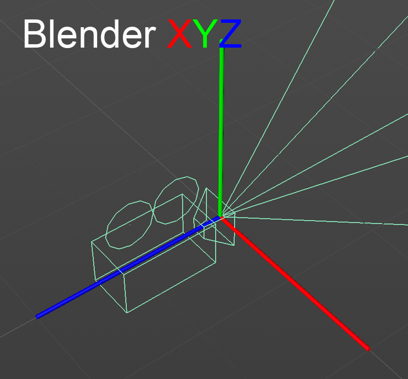

#### Dataset Camera Arrangement

The cameras are arranged as described below. Use this information to help you figure out your camera format.

* The camera origins are always exactly 2 units from the origin.
* The world up vector is $+y$, and all cameras have $y \geq 0$.
* All camera look vectors point directly at the origin.
* All camera up vectors are pointed "up" in the world. In other words, the dot product between any camera up vector and $+y$ is positive.

Hint: How might one build a rotation matrix to convert between camera coordinate systems?

#### Checking Your Work

Check your work by running:
```
python3 -m scripts.2_puzzle
```
If your conversion function works correctly, you should be able to exactly reproduce the images in your dataset. If you want to test your `load_dataset` function in isolation, you can use the dataset located at `data/sample_dataset` with a `convert_dataset` that simply returns its input.

Note that you may use the mesh at `data/stanford_bunny.obj` if you find it helpful to do so, although using it is not required to find the solution.


## Part 3 - Edge Detection (10 pts)

The most important part of any SfM pipeline is calibrating the camera. This is commonly done with a chessboard object containing a specified number of squares. The best calibration comes from chessboards that space the entirety of the image plane, so chessboard images are not necessarly square like a normal chessboard. In this exercise, you will identify the edges, or the contours of the image. This is a critical step in calibrating the camera. There are many possible implementations for edge detectors, we only require that you not use an existing utility like opencv to detect contours, or other similiar libraries.

### 3.a - Image Preperation (5 pts)

Complete the `ContourImage()` class `edge_identification.py` to prepare the image for processing. Specifically, complete definitions for `binarize(self)` and `fill_border(self)`. This is a typical step in edge detection in imagery, so if you are confused, we encourage you to review online resources.

### 3.b - Find Contours (5 pts)

Complete the `find_contours(binary_image, foreground=1)` function definition in `edge_identification.py`, then run `python -m src.edge_identification`. The output of this function should be a one-dimensional list of `(u, v)` coordinates of every edge in the image. Your final output will look similar to the image below.

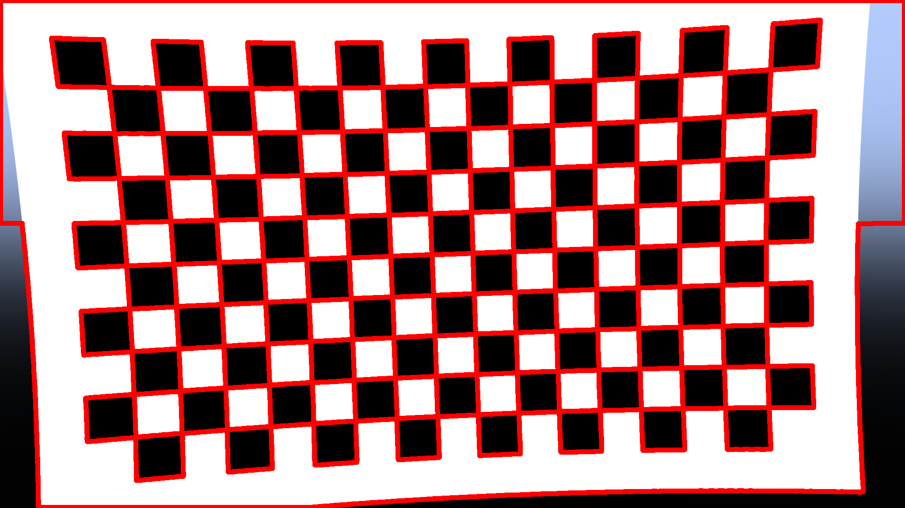

## Part 4 - Camera Calibration (15 pts)

From the edge contours of the chessboard image, it is trivial, yet time-consuming, to then form quadrilaterals and detect the corners of each square. We have instead used the existing OpenCV implementation of `cv2.findChessboardCorners`. With the chessboard corners, we can now recover the intrinsic properties of the camera, and correct for any distortions. There are many methods of recovering camera calibration, and each involves assumptions about the camera, as such, no implementation will be exactly the same. We provide a wrapper for the OpenCV implementation of `cv2.calibrateCamera`.

### 4.a - The Projection Matrix (4 pts)

In previous psets, you have already been introduced to the Intrinsic Camera Matrix, *K*,

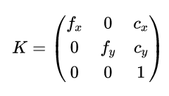

Where `f_x, f_y` are the focal ratios for that axis and `c_x, c_y` are the `u, v` coordinates for the center of the image.

Imagine a pinhole camera with a small aperture (“pinhole”) at the origin of our coordinate system. The camera is oriented so that the optical (principal) axis is the Z-axis, pointing forward. The image plane is placed at Z = f (focal length f ) in front of the pinhole. A pinhole camera creates a perfect image with no distortions where `f_x = f_y = f_r * min(image_height, image_width)` and `f_r = 1 / 2tan(FoV/2)` where the FoV (Field of View) is in radians. Assume the FoV is 45 degrees. Calculate an intrinsic matrix for the image found in `data/edge_identification/chessboard.png` and assign the value of `ideal_instrinsic_matrix` in `calibrate_camera.py`.

### 4.b - Find Corners (2 pts)

In `calibrate_camera.py`, define the interior dimensions (number of squares - 1) of `chessboard_size`. You should see an image similar to the one below with the corners drawn on the chessboard.

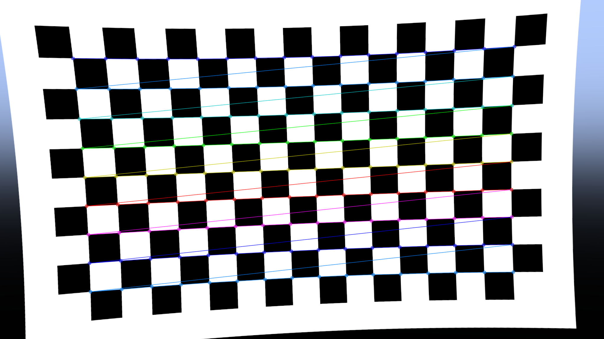

### 4.c - Calibrate Camera (4 pts)

To calibrate the camera, we need to compare the image corners with the corresponding points of a known 3D object. In this case, it is the chessboard. We can assume the surface of the chessboard is perfectly flat, so all z-values of the object points should be 0. Complete the `get_3D_object_points(chessboard_size)` in `calibrate_camera.py` which defines the corresponding 3D points for each corner. You can assume the first point is (0, 0, 0) and the last point is (chessboard_size[0]-1, chessboard_size[1]-1, 0). The 3D points should be in the same order as the recovered chessboard corners.

Once you have correctly defined the 3D points, you should be able to recover the intrinsic matrix and estimated distortion coefficients. We have artificially distorted the image, so the recovered intrinsic matrix may be different from the ideal matrix you computed in 2.a.

**Note:** All methods of camera calibration are providing an over-fitted guess, thus the recovered distorition will not be the same as the actual distortion applied to the image.

### 4.d - Image Distortions (5 pts)

The most common form of image distortion is radial distortion. Every real camera has some amount of radial distortion that must be corrected for Multi-View Geometry.

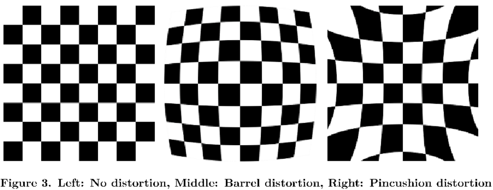

Distortion Coefficients recovered by OpenCV are defined as $(k_1, k_2, p_1, p_2, k_3)$

The below equation applies a distortion.

$$x_\text{distorted} = x(1 + k_1 r^2 + k_2 r^4 + k_3 r^6) + 2p_1xy + p_2(r^2 + 2x^2)$$

$$y_\text{distorted} = y(1 + k_1 r^2 + k_2 r^4 + k_3 r^6) + 2p_2xy + p_1(r^2 + 2y^2)$$

where 

$$r^2 = x^2 + y^2$$

Your task is to undo the distortion of the original image using the recovered intrinsic matrix and distortion coefficients by completing the definition of `undistort_image(image, camera_matrix, dist_coeffs)` in `calibrate_camera.py`. 

Run `python -m src.camera_calibration` to recover the camera parameters from simulation.

Do not use OpenCV functions. If you are stuck, you may use `cv2.getOptimalNewCameraMatrix` and `cv2.undistort` for half credit. If you do use OpenCV, it is helpful to break the problem down into two parts: 
1. Recover the Optimal Camera Matrix, and
2. Undistort the image.

## Part 5 - Epipolar Geometry (15 pts)

In this part, you will work on the geometric relationship between two views of a scene. Your goal is to compute the fundamental matrix using two different methods and then use the matrix to draw epipolar lines that explain how points in one image constrain the location of corresponding points in the other image.

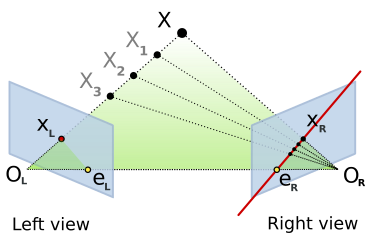

### 5.a - Fundamental Matrix - Least Squares Method (5 pts)

Implement the `lstsq_eight_point_alg` in `fundamental_matrix.py`. This method forms a system of equations based on corresponding points in two images. By stacking the constraints into a matrix (denoted as W), the method uses singular value decomposition (SVD) to solve for the fundamental matrix F that satisfies:

$$p'^TFp = 0$$

After obtaining an initial solution, enforce that F has rank 2 by zeroing out the smallest singular value. Do not use OpenCV functions in this section.

### 5.b - Fundamental Matrix - Normalized Method (5 pts)

Implement the `normalized_eight_point_alg` in `fundamental_matrix.py`. In the normalized eight-point algorithm, you first normalize the coordinates of the input points by translating the points so that their centroid is at the origin and scaling the points so that the mean squared distance from the origin is 2.

The normalization is done with transformation matrices $T$ and $T'$. Once normalized, you compute the fundamental matrix using the least-squares method from Part 3.a and then “denormalize” the result to obtain the final fundamental matrix.

The normalization further refines $F$. Notice how the average distance to the epipolar lines are smaller using the normalized method. Do not use OpenCV functions in this section.

### 5.c - Compute Epipolar Lines (5 pts)

Now implement `compute_epipolar_lines`. Once you have a fundamental matrix, you can compute the corresponding epipolar line for any given point in one image. The epipolar line is computed by multiplying the fundamental matrix with the homogeneous coordinate of a point, where `l = F.dot(p)`.

$$l$$ is the line defined by $$Ax + By + C = 0$$. Extract the line parameters as a slope-intercept $$(m, b)$$ in $$y = mx + b$$ for easy drawing on the image.

Run `python -m src.image_rectification` to produce the resulting images. You should now see that all epipolar lines pass through or close to the defined points.


## Part 6 - Image Rectification (10 pts)

In this part, you will work on aligning (rectifying) two images so that their epipolar lines become horizontal. Rectification is a critical step for stereo vision, as it simplifies correspondence search between images.

### 6.a - Compute Epipoles (2 pts)

The epipoles are the points of intersection of the camera's optical axis with the image plane. They serve as the "center of projection" for the corresponding epipolar lines in each image.

Implement `compute_epipole` in `image_rectification.py`. Compute the epipolar lines by multiplying the fundamental matrix with the points from the other image. Use singular value decomposition (SVD) to solve for the epipole that satisfies the homogeneous equation l.dot(e) = 0, where l is the epipolar line and e is the epipole. Normalize the epipole so that the last coordinate is 1. Do not use OpenCV functions in this section.

### 6.b - Matching Homographies (2 pts)

Once you have the epipoles, the next step is to compute the homographies that will align (rectify) the images.

Implement the function `compute_matching_homographies`.

For the first image, use the computed $$H_2$$ and additional constraints based on the fundamental matrix to compute a matching homography $$H_1$$ that maintains the correspondence between the two rectified images.

For the second image, translate the image so that its center is at the origin. Rotate the image so that the epipole is aligned with the x-axis. Apply a projective transformation that sends the epipole to infinity. Combine these steps into a single homography $$H_2$$.

Solve for the affine component using a least-squares fit (`np.linalg.lstsq`) that relates the transformed matching points in the two images. Do not use OpenCV functions in this section.

### 6.c - Rectifying Images (3 pts)

After computing the homographies, use them to transform the images into a rectified coordinate system where the epipolar lines are horizontal.

Implement the function `compute_rectified_image(im, H)` which applies the homography H to an image. First, compute the new coordinates for each pixel using the homography. Determine the new image bounds and calculate the offsets. Use the inverse homography to map every point from the rectified image back to the original image to sample the pixel values. Return the rectified image and the offsets, which will be used to align the two images.

Once rectified, corresponding points in the two images should lie on the same horizontal line, which can be verified by the output image. Do not use OpenCV functions in this section.

Now, run `python -m src.image_rectification` get the rectified images of our test object. The rectification output should look like this:
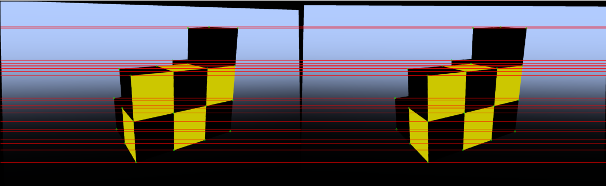


### 6.d - Feature Detection (3 pts)

There have been many algorithms developed for feature detection over the years, with each iteration improving on the last. SIFT, SURF, and ORB are all popular implementations of feature detectors that common points between different images using keypoints and descriptors for those points. ORB is an improvement of SIFT and SURF that tends to produce the most matched features.

Implement `find_matches` using `cv2.SIFT_create()` to identify features between two images. Then use Fast Linear Nearest Neighbors (FLANN) matching from `cv2.FLANNMatcher` with `FLANN_INDEX_KDTREE = 1`, `index_params = dict(algorithm = FLANN_INDEX_KDTREE, trees = 5)`, and `search_params = dict(checks=50)` to match the possible features.

Filter for `good_matches` by using a ratio threshold of 0.75.

## Part 7 - 3D Reconstruction (20 pts)

This is the last component of a basic Structure from Motion pipeline. More complex versions of SfM have further refining steps like dense reconstruction and texturing, but we will stop at a sparse point cloud. We'll be constructing a point cloud of a model of the Arc de Triomphe, which is found in `data/3D_reconstruction/arc_de_triomphe`

### 7.a - OpenCV Fundamental Matrix (3 pts)

Implement `recover_fundamental_matrix`

Leverage OpenCV’s RANSAC-based method to compute the fundamental matrix from matched feature points between two images. Use a threshold of 1.0 and confidence of 0.99.

### 7.b - Compute Essential Matrix (3 pts)

Implement `compute_essential_matrix`

Convert the fundamental matrix into the essential matrix using the intrinsic camera matrix. The essential matrix relates corresponding normalized image points and is used to derive the relative camera pose.

$$E = K^T F K$$

### 7.c - Estimate Camera Pose (4 pts)

Implement `estimate_initial_RT`.

Use singular value decomposition (SVD) of the essential matrix to obtain two candidate rotations and two candidate translations. These are potential relative poses between the camera views.

### 7.d - Recover Best Camera Pose (5 pts)

Implement `find_best_RT`.

To resolve ambiguities, triangulate the 3D points for each candidate pose. The correct pose is the one that yields the maximum number of points with positive depth in both camera coordinate systems. You are encouraged to use `cv2.triangulatePoints` to solve for which combination of candidate rotations and translations results in a positive depth.

### 7.e - Define Project Matrixes (5 pts)

Implement `get_identity_projection_matrix` and `get_relative_projection_matrix`. The identity projection should be the dot product of the camera matrix and \[I|0\]. P2 should similarly be the the dot product of the camera matrix and \[R|T\].

With the projection matrixes defined, we can now triangulate the points relative to the projections. This yeilds a 4D homogenous point, which we convert to 3D points. You can see the 3D points in the matplotlib plot. 

The singular values of the fundamental matrix are also listed as a sanity check. F should have a rank of 2. If the second value in value is very close to zero, the solution may be degenerate, which would result in a linear point cloud.

Now, you can run `python -m src.3D_reconstruction` to get a point cloud from stereo views of the Arc de Triomphe. Run with the `--setup` flag if you want to generate new images of the Arc de Triomphe (may take a while!).

Expected SIFT output:

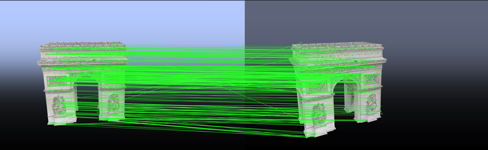

Expected point cloud output:

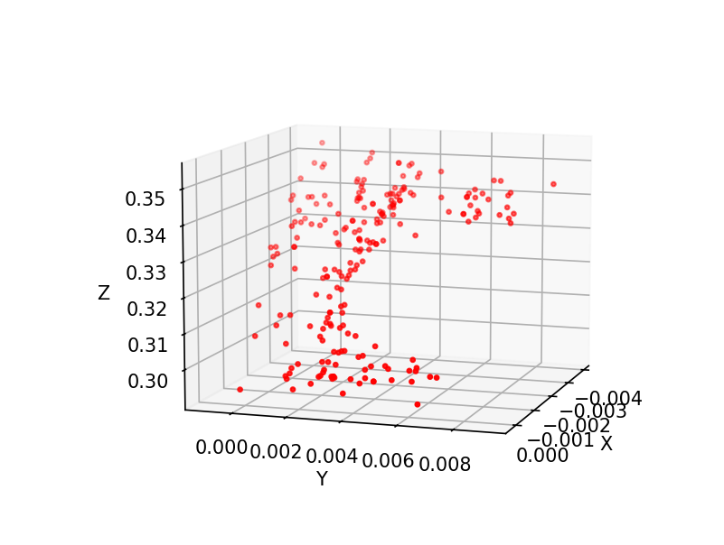


## Part 8 - full SfM pipeline (extra credit, open-ended) (10 pts)
Now, we can use all of the previous functions to get a point cloud from more than two images. This might require bundle adjustment for jointly optimizing camera parameters and the point cloud, as well as defining some correspondences manually, to get a reasonable looking point cloud. Implement `bundle adjustment`, `reprojection_error`, and `main` in `SFM_pipeline.py` to get a point cloud of the statue dataset `env.p8.statue_images` from 5 or more views. We will only be grading your implementation of `bundle_adjustment` and `reprojection_error`. Then run `python -m src.SfM_pipeline` to produce a point cloud.

This was our output point cloud from the statue dataset (using some handcrafted points):
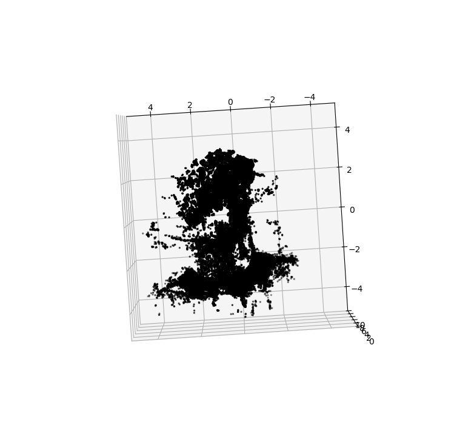

Feel free to run camera calibration on your own phone using a printed-out checkerboard if you want to capture real-world images! We recommend printing out the checkerboard intead of taking pictures of the checkerboard on your screen to reduce moire effects. The checkerboard should cover the entire FoV of the camera.


## Collaboration Policy

You may work with other students and use AI tools (e.g., ChatGPT, GitHub Copilot), but must submit code that you understand fully and have written either by yourself or together with one other student.

## Submission Policy

Double-check that you have not changed any of the function signatures in `geometry.py`, `puzzle.py`, `rendering.py`. Also, ensure the functions in `provided_code.py` are not changed. Submit in Moodle.

## Credits
This HW assignment is adapted from that given in 6.8300, Advances In Computer Vision by Vincent Sitzmann in 2025, created partially by Christian Arnold and Isabella Yu. It is also adapted from from CS231A, taught by Jeannette Bohg and Silvio Savarese in 2024. 
The Arc de Triomphe model can be found here: https://rigmodels.com/model.php?view=Arc_de_Triomphe_3d_model__65937fd27de647c0a8ac99ce8275c03e. It has a royalty-free license.
